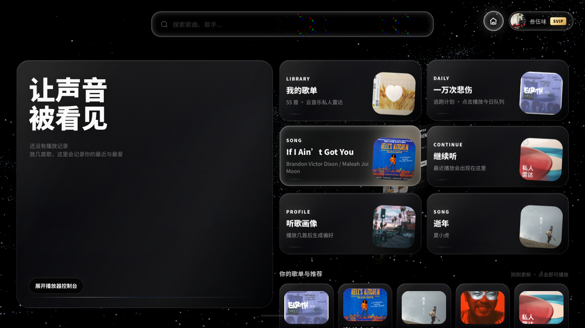
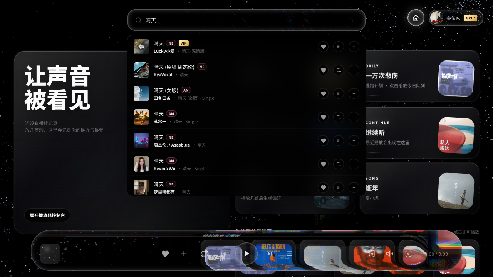
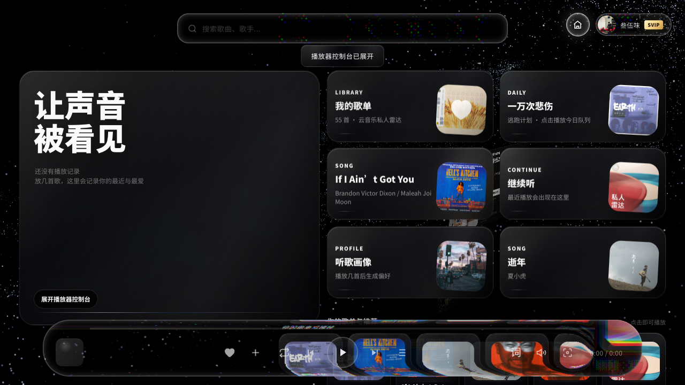

# Voice of the Heart Pro Max - 基于 Mineradio 二次开发

Voice of the Heart Pro Max 是一款基于 Mineradio 二次开发的沉浸式音乐可视化播放器，把搜索、播放、歌单、歌词舞台、粒子视觉、封面视觉和桌面氛围整合到一个深色玻璃质感的音乐空间里。它从 Mineradio 的桌面体验演进而来，目标是让音乐不仅能被听见，也能被看见。

当前公开版本：`v0.0.1`

## 预览







## 特色功能

- 沉浸式首页：星河背景、玻璃卡片、最近播放、歌单与推荐入口。
- 多平台搜索：支持网易云、Apple Music 试听、本地与播客等入口组合。
- 播放器控制台：播放/暂停、上下首、喜欢、收藏、队列、歌词、音量和沉浸模式。
- 歌词与视觉舞台：歌词层、粒子、封面、照片轮播和音乐律动视觉。
- 歌单与队列：支持当前队列、我的歌单、播客和推荐内容浏览。
- 真实频谱接入：macOS 可配合 BlackHole 等虚拟声卡，让视觉跟随系统音频律动。
- 深色高级质感：以玻璃、暗场、粒子和专辑封面为核心视觉语言。

## 下载

请到 [v0.0.1 Release](https://github.com/futuredo/voice-of-the-heart/releases/tag/v0.0.1) 下载对应系统的安装包。

| 设备 / 系统 | 应下载的文件 | 说明 |
| --- | --- | --- |
| Apple 芯片 Mac | `VoiceOfTheHeart-0.0.1-arm64.dmg` | 适用于 M1 / M2 / M3 / M4 等 Apple Silicon |
| Intel 芯片 Mac | `VoiceOfTheHeart-0.0.1-x64.dmg` | 适用于 Intel 处理器 Mac |
| Windows 电脑 | `VoiceOfTheHeart-0.0.1-Setup.exe` | 适用于常见 64 位 Windows 电脑 |

不要下载 `Source code`、`.blockmap` 或 `latest*.yml` 作为安装包；这些文件主要用于发布和更新校验。

## 安装说明

### macOS

1. 下载对应架构的 `.dmg` 文件。
2. 双击打开 DMG。
3. 将 `Voice of the Heart.app` 拖入 `Applications`。
4. 从 `Applications` 打开应用。

当前版本未使用 Apple Developer ID 公证。首次打开如果提示“无法验证开发者”，可以右键应用选择“打开”，或进入：

```text
系统设置 > 隐私与安全性
```

在页面底部选择“仍要打开”。

### Windows

1. 下载 `VoiceOfTheHeart-0.0.1-Setup.exe`。
2. 双击运行安装包。
3. 按安装器提示完成安装。

小众 Electron 应用可能触发浏览器、Windows Defender 或 SmartScreen 提醒。请先确认文件来自本仓库 Release；如 SmartScreen 拦截，可点击“更多信息”后选择“仍要运行”。

## 文件校验

下载后可以用下面的 SHA256 校验文件完整性：

```text
VoiceOfTheHeart-0.0.1-arm64.dmg
5fd420fe6ccda28f6ccf85c2e5586df9e9447c935a4ff367c5d4deac543edeec

VoiceOfTheHeart-0.0.1-x64.dmg
c254ad277e7248719c0d07df85e54a59b12b36c868ff3f8e7ad8116686bde4bc

VoiceOfTheHeart-0.0.1-Setup.exe
d1eae6ddf3b0ecd159fbb5576c3cfccdd2c6d3c52ae914eb84c449d741e8cabe
```

macOS / Linux：

```sh
shasum -a 256 "VoiceOfTheHeart-0.0.1-arm64.dmg"
```

Windows PowerShell：

```powershell
Get-FileHash .\VoiceOfTheHeart-0.0.1-Setup.exe -Algorithm SHA256
```

## 权限与数据

应用可能会请求麦克风权限，用于音频分析和频谱视觉。用户登录态、播放缓存、搜索历史、封面缓存和运行数据保存在本机用户目录中，不会被打包进安装包。

常见数据目录：

```text
~/Library/Application Support/Voice of the Heart/
```

## 项目说明

Voice of the Heart 不是网易云音乐、QQ 音乐、Apple Music 或任何第三方音乐平台的官方客户端。相关平台接入仅用于个人学习、本地客户端体验和用户自有账号的播放辅助。请遵守对应平台的用户协议、版权规则和会员权益规则。

## 授权

本项目基于 GPL-3.0 授权。界面视觉、Voice of the Heart 名称、图标和原创视觉表达归作者所有；第三方依赖和第三方服务分别遵循其各自授权与服务条款。
